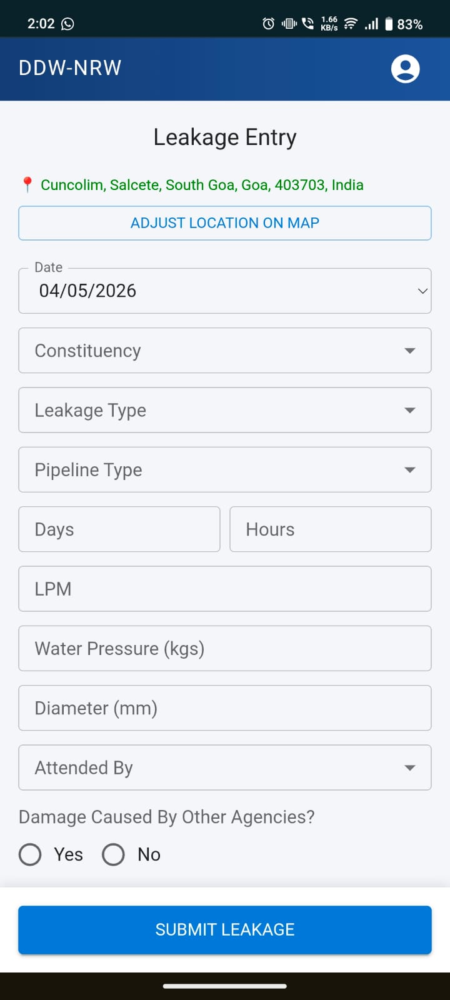
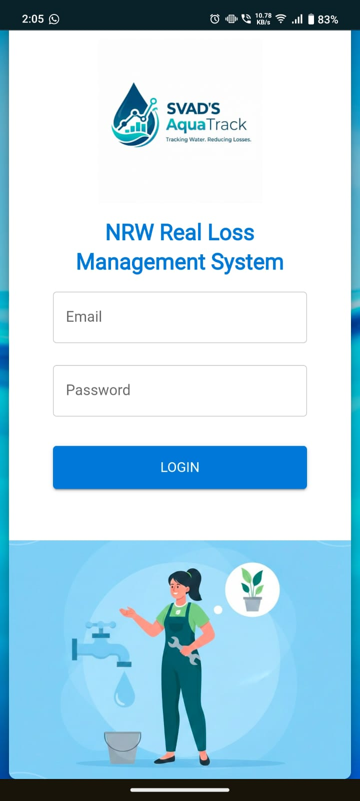
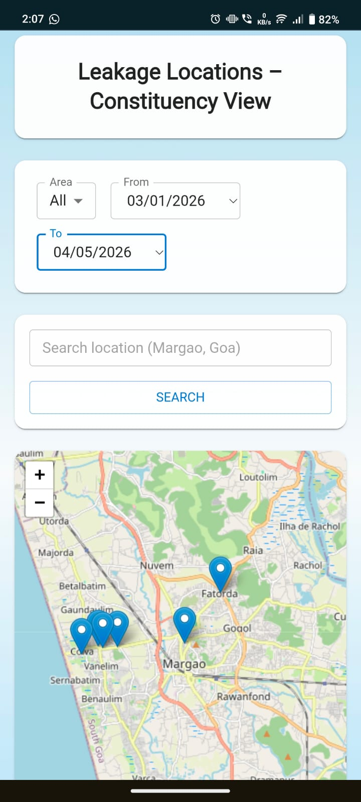

# 💧 NRW Real Loss Monitoring System

### Public Works Department (PWD) — Department of Drinking Water, Goa

A Progressive Web Application (PWA) built for the Public Works Department to monitor and track **Non-Revenue Water (NRW) real losses** caused by pipeline leakages across constituencies in Goa, India.

---

## 📱 Overview

Field engineers use this mobile PWA to report pipeline leakages directly from the field, while administrators analyze the collected data through a dashboard. The system digitizes what was previously a manual, paper-based process.

---

## ✨ Features

### Engineer (Mobile PWA)

- 📍 Automatic GPS location capture on form load
- 🗺️ Manual location adjustment using interactive map
- 📋 Structured leakage reporting form
- 💧 Real-time water loss estimation
- 📶 Offline support - reports saved locally and synced when internet returns
- 📱 Installable as a PWA on Android/iOS

### Admin (Desktop Dashboard)

- 📊 Analytics dashboard with charts
- 🗂️ View and filter all leakage reports
- 📤 Export data to Excel (.xlsx)
- 👷 Add, delete, and manage engineers
- 🏘️ Assign constituencies to engineers

---

## 🛠️ Technology Stack

| Layer          | Technology                                  |
| -------------- | ------------------------------------------- |
| Frontend       | React (Vite), JavaScript, Material UI (MUI) |
| Mapping        | Leaflet, OpenStreetMap, Nominatim API       |
| Database       | Firebase Firestore                          |
| Authentication | Firebase Authentication                     |
| Hosting        | Firebase Hosting                            |
| PWA            | vite-plugin-pwa, Service Workers            |
| Charts         | Recharts, Chart.js                          |
| Data Export    | XLSX, file-saver                            |

---

## 🧮 Water Loss Estimation Formula

Water loss is estimated using a flow-based formula:

```
durationMinutes = (days × 1440) + (hours × 60)

pipeArea = π × (diameter_in_meters / 2)²

adjustedFlow = LPM × √pressure × (pipeArea × 1000)

estimatedLoss (litres) = adjustedFlow × durationMinutes
```

**Parameters:**

- LPM — Litres per minute (measured flow rate)
- Pressure — kg/cm²
- Diameter — Pipeline diameter in mm
- Duration — Total leakage duration in minutes

---

## 🗃️ Firestore Data Structure

```
users/
  {uid}/
    name
    email
    role           (admin | engineer)
    constituency
    mustChangePassword
    createdAt

leakages/
  {docId}/
    engineerId
    date
    constituency
    leakageType    (Breakdown | Corrosion | Man-made | Aging)
    pipelineType   (GI | PVC | OPVC | AC | DI | HDPE)
    days
    hours
    lpm
    pressure
    diameter
    plumberName
    attendedBy     (Department | External Agency)
    damagedByAgency
    agencyName
    durationMinutes
    waterLoss
    location/
      lat
      lng
      address
    reportDate
    createdAt
```

---

## 🚀 Getting Started

### Prerequisites

- Node.js v18+
- Firebase project with Firestore and Authentication enabled

### Installation

```bash
# Clone the repository
git clone https://github.com/aarth-01/pwd-nrw-web.git

# Navigate into the project
cd pwd-nrw-web

# Install dependencies
npm install
```

### Environment Setup

Create a `.env` file in the root directory:

```bash
VITE_FIREBASE_API_KEY=your_api_key
VITE_FIREBASE_AUTH_DOMAIN=your_project_id.firebaseapp.com
VITE_FIREBASE_PROJECT_ID=your_project_id
VITE_FIREBASE_STORAGE_BUCKET=your_project_id.firebasestorage.app
VITE_FIREBASE_MESSAGING_SENDER_ID=your_sender_id
VITE_FIREBASE_APP_ID=your_app_id
```

> ⚠️ Never commit your `.env` file. Make sure it is listed in `.gitignore`.

### Running Locally

```bash
npm run dev
```

### Building for Production

```bash
npm run build
```

### Deploying to Firebase Hosting

```bash
firebase deploy --only hosting
```

---

## 🔐 Security

- Firebase Authentication for all users
- Firestore Security Rules enforce role-based access:
  - Engineers can only read and create their own leakage records
  - Admins have full read access across all records
  - No user can modify or delete leakage records except admins
- Environment variables used for all Firebase config values
- Input validation and sanitization on all form fields
- Rate limiting on form submissions to prevent spam

---

## 📂 Project Structure

```
src/
├── assets/              # Images and static files
├── components/          # Shared components (Navbar, etc.)
├── pages/
│   ├── admin/           # Admin dashboard pages
│   └── engineer/        # Engineer mobile pages
│       ├── LeakageForm.jsx
│       ├── RecentLeakages.jsx
│       ├── MapPicker.jsx
│       └── SuccessPage.jsx
├── firebase.js          # Firebase initialization
└── main.jsx             # App entry point
```

---

## 📸 Screenshots

<p align="center">
  
  &nbsp;&nbsp;
  
  &nbsp;&nbsp;
  
</p>

<table align="center" border="0">
  <tr>
    <td align="center" width="30%"><em>Engineer Mobile Form</em></td>
    <td align="center" width="30%"><em>Login Page</em></td>
    <td align="center" width="30%"><em>Admin Map View</em></td>
  </tr>
</table>

## 🏛️ Developed For

**Public Works Department (PWD)**
Department of Drinking Water
Government of Goa, India

---

## 👨‍💻 Authors

**Aarth Vajandar**  
**Shreya Toraskar**  
**Suhani Joshi**  
**Disha Seethapathy**

---

## 📄 License

This project was developed as part of academic research for the Public Works Department, Goa.
Not licensed for commercial use.

---

## 🙏 Acknowledgements

- [OpenStreetMap](https://www.openstreetmap.org/) and [Nominatim](https://nominatim.org/) for free mapping and geocoding
- [Firebase](https://firebase.google.com/) for backend infrastructure
- [Material UI](https://mui.com/) for the component library
- Public Works Department, Goa for domain guidance and requirements
